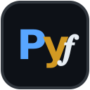

# 🐍 David's Python Courses

### *Interactive Python courses that run entirely in your browser — no install, no account, no fear.*

<p align="center">
  
  
</p>

<p align="center">
  <b>Read a little. Run a lot. Break things on purpose. Build real programs.</b><br>
  Python 3.12 · Runnable code boxes · Built-in console · Quizzes · Exercises with solutions · Guided projects
</p>

<p align="center">
  
  
  
  
  
</p>

Live site: **https://davidhinkley.github.io**

| Course | Start here | Guide |
|---|---|---|
| 🐍 **Python Foundations** (beginner) | https://davidhinkley.github.io/python-course.html | [`python-course.md`](python-course.md) |
| 🐍 **Python Intermediate** (next step) | https://davidhinkley.github.io/python-intermediate.html | [`python-intermediate.md`](python-intermediate.md) |

---

## ⚡ Quick start

Zero install. Open either link above in any modern browser (Firefox, Chrome, Edge, Safari — Windows, macOS, Linux, Chromebook) — or locally, open the matching `.html` file from this repo.

That's it. You get:

- Runnable / editable code boxes (100 in Foundations + 7 references, 139 in Intermediate + 29 references/transcripts)
- Built-in Python console (REPL) sharing state with the lesson boxes
- Quizzes with instant explanations (6 each, 30 questions each), exercises with hidden solutions (19 + 21), guided projects (5 + 3 capstones)
- Python 3.12 runs locally in your browser tab via Pyodide and stays completely local
- First load fetches the Python engine (~10 MB) once; after that it works offline
- Progress and saved edits are stored by your browser (`localStorage` — Intermediate uses a separate `pyi:*` namespace, safe side-by-side with Foundations)

The workflow of both courses: **Read → Predict → Run → Tinker → Break → Fix → Build** — Intermediate adds **Trace** between Predict and Run (*"what is `x` at line N?"*).

---

## 📁 Site files

| File | Role |
|---|---|
| `index.html` | **Landing page** for https://davidhinkley.github.io — introduces and links both courses. |
| `python-course.html` | **The whole Foundations course.** Content + browser runtime in one self-contained file. |
| `Pyf-icon.svg` | Foundations icon (`Pyf` badge). Favicon / brand icon for `python-course.html` and `index.html`. |
| `python-course.md` | Foundations guide — the friendly manual for the beginner course. |
| `python-intermediate.html` | **The whole Intermediate course.** Content + browser runtime in one self-contained file. |
| `PyI-icon.svg` | Intermediate icon (`PyI` badge). Favicon / brand icon for `python-intermediate.html` and `index.html`. |
| `python-intermediate.md` | Intermediate guide — the friendly manual for the follow-on course. |
| `README.md` | This file — the combined guide GitHub displays. |

> Do not edit the `.html` files unless you mean to change a course itself — learner edits and progress are stored separately in the browser.

---

## 📗 Python Foundations — beginner course

**David's Python Foundations** is a complete Python 3 course packed into [`python-course.html`](https://davidhinkley.github.io/python-course.html). Open it and you get a real interpreter, a textbook, a lab, a quiz master, and a patient debugger — all in one tab. Full details: [`python-course.md`](python-course.md).

> If you've never written a line of code, start here. You don't read about Python here. **You drive it from line one.**

```python
print("Hello, World!")
print("I am learning Python inside my own browser 🎉")
# 👆 That box is live in the course. Press ▶ Run. Change it. Run it again.
```

### What you'll learn

From `print()` to fetching live data from an API.

| Module | You'll learn | You'll build |
|---|---|---|
| **0 · Start Here** | How the course works, the console / REPL, blocks & indentation | Your first program + console superpowers |
| **1 · Variables, Types & Operators** | `print()`, variables, `int/float/str/bool`, strings, f-strings, `input()`, arithmetic, comparisons, logic | Tip calculator, time converter |
| **2 · Control Flow** | `if/elif/else`, `for` + `range()`, looping over data, `while`, `break/continue`, debugging tracebacks | 🎮 **Project 1: Number Guessing Game** |
| **3 · Data Structures** | Lists + methods, tuples & unpacking, dicts (incl. counting pattern), sets, how to choose | 📝 **Project 2: To-Do List Manager** |
| **4 · Functions & Modules** | `def`, `return` vs `print`, defaults & keywords, scope, `math` & `random`, writing your own module | 🧮 **Project 3: Calculator** |
| **5 · Objects & Classes** | Classes vs objects, `__init__` & `self`, methods & `__str__`, inheritance & `super()` | Bank accounts, rectangles, `Student(Person)` |
| **6 · Files & Errors** | `open()` modes, `with` auto-close, `try/except/else/finally`, `raise`, bullet-proof `input()` | Crash-proof programs, settings file |
| **7 · Projects** | Combining everything: dict-of-dicts worlds, classes + game loops, persistence with `datetime` | 🏰 **Project 4: Escape the Manor** + 📔 **Capstone: Personal Journal** |
| **8 · Ecosystem** | `pip` / `micropip`, `numpy` arrays, `json`, real APIs with `pyfetch`/`requests`, `help()`, editors, what's next | Live web data fetch, weather parser |
| **Appendices** | Error Field Guide (12 classic errors), Cheat Sheet, Checklist | Debugging confidence + forever reference |

### The 5 programs you'll finish

1. **🎮 Number Guessing Game** — `random`, `while True`, `input()`, counters, `break`
2. **📝 To-Do List Manager** — command loop (`add/list/done/quit`), lists, `enumerate`, safe indexes
3. **🧮 Calculator** — tiny functions + thin `main()`, dispatch, divide-by-zero grace
4. **🏰 Escape the Manor** — text adventure with rooms-as-dicts, `Player` class, `go/take/look/quit` parser
5. **📔 Personal Journal (capstone)** — `datetime` stamps, `date|text` file format, load/save that survives missing files and bad lines, then a JSON upgrade path

Each project has a **starter → build order → hints → full solution → 🚀 extensions**.

### Why beginners finish it

Live code boxes everywhere, Predict-then-Run habit, deliberate 🐞 crash boxes (read tracebacks bottom-up), 19 exercises with hidden solutions, 6 in-page quizzes, auto-saved edits, progress bar, ✅ lesson checkmarks, dark/light theme.

---

## 📘 Python Intermediate — the next course

**David's Python Intermediate** assumes ~100-line Foundations programs and graduates you to **200–400-line tested, CLI-driven programs** from the standard library plus `pytest`. Full details: [`python-intermediate.md`](python-intermediate.md).

> **Prerequisite:** variables, loops, lists/dicts, functions, basic classes, files + `try/except`. Not sure? Lesson 0.2 is a 10-task entry diagnostic — under 7/10 and it tells you exactly which Foundations modules to redo.

```python
from collections import Counter

votes = ["yes", "no", "yes", "yes"]
print(Counter(votes).most_common(1))  # [('yes', 3)] — Module 1 in one line
# 👆 That box is live in the course. Predict. Trace. Run. Break it.
```

### Where does each lesson run?

| Badge | Meaning | You… |
|---|---|---|
| 🟢 Browser-safe | Runs identically in the tab (Pyodide) | press Run here |
| 🟡 Browser-adapted | Same concept, shimmed I/O (in-memory files / `pyfetch`) | run here, redo on your PC with real files / `requests` |
| 🔴 Terminal-required | Needs a real CLI: venv, multi-file, pytest | do it on your PC — the browser box is read-only |

Rule of thumb: **browser for concepts, your own terminal for real files, CLIs, venv, and pytest** (Lesson 0.3 sets it up in five minutes; Module 6+ uses it).

### What you'll learn

From `Counter` one-liners to a tested JSON API.

| Module | You'll learn | You'll build |
|---|---|---|
| **0 · Bridge In** | What "intermediate" means, entry diagnostic, browser↔terminal setup, traceback refresher | venv + project folder, trace-table habit |
| **1 · Pythonic Data** | Comprehensions (and when NOT), `enumerate`/`zip`/`sorted(key)`, `*` unpacking, `Counter`/`defaultdict`/`namedtuple`, `join`, truthiness | Top-words reporter |
| **2 · Functions as Objects** | First-class functions, lambda discipline, closures + late-binding trap, `map`/`filter` vs comps, `itertools`, `lru_cache`/`partial` | Dispatch table, ranked leaderboard |
| **3 · Lazy Python** | Iterator protocol, `yield`, `yield from`, genexps, lazy pipelines, `contextlib` bridge | Log pipeline, chunked batches |
| **4 · OOP That Pays** | `@dataclass`, `str`/`repr`/`eq`/`len`, composition vs inheritance, `@property` validation, custom exceptions + `raise from` | Refactored Bank account lab |
| **5 · Files, Data & Storage** | `pathlib`, `csv` (quoted commas, `newline=""`), `json` round-trips + live fetch, `sqlite3` CRUD, regex + datetime cleaning | Journal `date\|text` → JSON → SQLite arc |
| **6 · Tooling & Quality** | Layout + venv + pip, `argparse` CLIs, `logging` levels, `pytest` asserts/fixtures, `pdb`/`breakpoint()` discipline | Logged greeting CLI |
| **7 · Power Tools** | Writing + stacking decorators with `wraps` (timer/retry), custom `with` + `@contextmanager`, timed/logged resources | Logged retry decorator |
| **8 · Capstones** | A) CLI file tool, B) CSV→SQLite reporter, C) tested mini-API — spec → build order → tests → extensions | **3 portfolio programs (200–400 lines)** |
| **Appendices** | Regex quick-ref, `itertools` cheat-sheet, error/`pytest` field guide + where-next lanes | Forever references |

### After Intermediate

Three lanes from Appendix C: **Web** (serve Capstone C → HTTP → Flask/FastAPI/Django), **Data** (10k-row reporters → SQL → pandas), **Automation** (scheduled tools → argparse mastery → packaging, cron/systemd).

> *You have three tested programs now. Go build the fourth.* 🐍

---

## 🗺️ Suggested path

1. **Foundations** — never coded? Start here. Finish with five working programs and debugging confidence.
2. **Intermediate diagnostic** (Lesson 0.2) — 10 tasks from memory. 7+/10: continue. Below that, redo the prescribed Foundations modules first.
3. **Intermediate** — browser for concepts, terminal for `venv`, real files, and `pytest`. Graduate with three tested portfolio programs.

---

## 🖥️ How the pages work

- First load needs internet once to fetch the Python engine (~10 MB, then cached). After that: **fully local, works offline, nothing leaves your tab.**
- `input()` shows as a small pop-up dialog (**Cancel = `EOFError`**, handled in-course on purpose).
- Files live in a **sandboxed in-browser filesystem** and vanish on tab close. Code is identical to desktop Python.
- True `while True:` with no `break` freezes the tab — reload, your code is saved.
- Supported browsers: current Firefox, Chrome, Edge, Safari on Windows, macOS, Linux, Chromebook.

## 🔒 Privacy & requirements

- **Requirements:** Any modern browser. Intermediate terminal work needs Python 3.9+ and a `venv` (Lesson 0.3).
- **Privacy:** No telemetry, no account, no server. Progress lives in your browser (`localStorage`).
- **Offline:** Yes, after first engine download. Only the live-API lessons need internet on purpose.

## 🛠️ Troubleshooting

- **Engine won't load / boxes read-only:** check internet on first load, then reload.
- **Froze the tab:** reload — code is saved. Every `while` needs something moving its condition toward `False`.
- **Files / progress gone?** In-page filesystem clears on tab close; clear-site-data wipes `localStorage` edits and checkmarks.
- **`pip install` fails with `externally-managed-environment`:** use a venv — never `--break-system-packages`.

## ❓ FAQ (short)

- **Install Python first?** No — it comes inside the page. Foundations 8.4 / Intermediate 0.3 walk you onto your own computer later.
- **`pip`, `numpy`, `requests`?** In-browser: `micropip` wheels, auto-`numpy` where supported, `pyfetch` for web. Full `pip` on your own PC.
- **Python 2 or 3?** Python 3.12 throughout. No Python 2-isms.

---

<p align="center">
  <b>David's Python Courses</b> · single-HTML courses · Python 3.12 in your tab via Pyodide · no data ever leaves your browser<br>
  Start with <a href="https://davidhinkley.github.io/python-course.html">Foundations</a>, continue with <a href="https://davidhinkley.github.io/python-intermediate.html">Intermediate</a>. Happy hacking!
</p>
